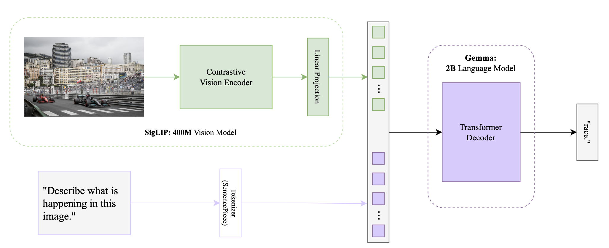
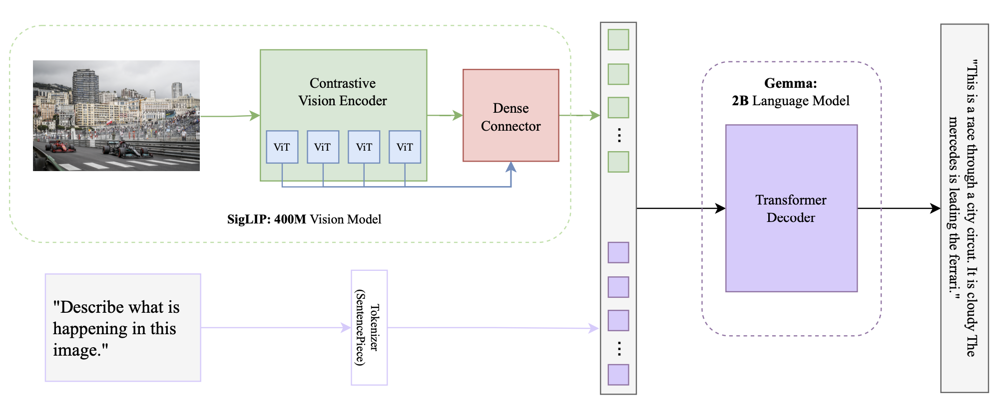

# VLM-o: Kinda Technical Report

## Summary
VLM-o is a 3B parameter multi-modal vision model built for image analysis and object detection. The model is inspired by the PaliGemma architecture. This project is an inference implementation written in PyTorch. The weights were originally used from HuggingFace's PaliGemma-3b-pt-224 repository and then fine-tuned using LoRA on the VQA2 dataset. In this project, I have 2 implementations, one vanilla implementation based on the PaliGemma Architecture, and one where a Dense Connector is introduced in place of the Linear Layer. This blog post won't cover all of the technical details of the model. For that, I'd recommend the PaliGemma Paper. This project is mainly an implementation of that paper. This post is more about what I did on top of that model, described in an informal way, which is why it's kinda a technical report. Disclaimer: this is a weekend project that already extended into 4 days so I don't have the time to work on it further, there is a lot of room for improvement, specifically fine-tuning, and I may have done some things wrong, I know. For code: https://github.com/vpareek2/vlm-o

## 1. Initial Implementation
The initial implementation of this model took the bulk of the time in this project. I initially chose this project after seeing that Umar Jamil implemented it on YouTube with a step by step guide, both coding and theory. I am pretty new when it comes to implementing ML papers, so I thought it'd be a good idea to have that as a reference. Which actually helped a lot. I feel like most of the implementing is pretty simple, I mean in PyTorch all you really have to do is initialize a bunch of pre-implemented topics, and forward through the part. Actually knowing what to put where is quite a different story. Making sure you have a good grasp of the actual concepts and how the different layers and functions work behind the scenes is very important from my view. I'm currently doing another project in C & CUDA which is giving me a good grasp of the concepts, albeit a lot more work. Anyways, I went ahead and implemented the original model, with the processing, to the siglip model, to the gemma model, then the inferencing. I did reference the youtube video for the rotary embeddings and the inference when I was having some trouble getting weights from huggingface to be compatible with the model. I did not originally know how exact all the model and variable names must be for the configs to match. I've provided below a picture of how the model architecture looks. After a bunch of bugs and logical problems, it finally compiled and it was a decent model, though it was still just a prompt finishing model. I tried doing some prompting tricks but it didn't work so I realized to have a decent question answering model I'd have to fine-tune it.

## 2. Fine-Tuning using LoRA
Fine-tuning took quite a bit of work because in the past I never fine-tuned weights from huggingface. Also, I wanted to somehow incorporate my implementation, all the guides and stuff online just tell you how to do it simply with a GUI or using an ipynb and like 10 lines of code huggingface gave. For real-world purposes, this is probably the best option, but I wanna learn new stuff while doing this so I decided to do a mix of both. Just being an inference file, I didn't write the training file and really didn't want to go back and do it. This approach allowed me to leverage some components I created, MultiModalProcessor and model loading and use the ease of access from huggingface. The fine-tuning pipeline went something like, LoRA config -> LoRA Linear Layer -> Applying LoRA -> Load Dataset & Model -> Process and apply LoRA -> Create dataset (VQAV2) PaliGemmaDataset -> Use HuggingFace Trainer() -> Save new weights. I should probably explain LoRA quickly.

### 2.1 LoRA (Low-Rank Adaptation)
LoRA (Low-Rank Adaptation) is a method for fine-tuning large neural networks efficiently. Instead of updating all model parameters, LoRA introduces small, low-rank matrices to adjust only specific parts of the model while freezing the rest. This reduces the computational cost and memory usage while maintaining performance. LoRA is particularly useful for adapting pre-trained models to new tasks with minimal additional training. For anyone wanting to know math:

In LoRA, we modify a weight matrix \( W \) in a neural network using low-rank matrices. Given a weight matrix \( W \) with dimensions \( d \times k \), LoRA introduces two low-rank matrices \( A \) and \( B \) where:
- \( A \) is of size \( d \times r \)
- \( B \) is of size \( r \times k \)
- \( r \) is a small rank compared to \( d \) and \( k \)

The adjusted weight matrix \( W' \) is defined as:
\[ W' = W + \Delta W \]
where:
\[ \Delta W = A \cdot B \]

Here, \( \Delta W \) represents the low-rank adaptation to the original weight matrix \( W \). This approach reduces the number of parameters that need to be updated during fine-tuning, making it computationally efficient.

### 2.2 Fine-Tuning Results
The fine tuning had decent results. I had some compute limitations, mostly because I didn't want to pay anything to any cloud gpu provider. So I fine-tuned with  my 3070. I could only do 10% of the VQAv2 dataset. It did kinda well, I say kinda because it didn't give amazing responses. It was really blunt. Actually the image in my repo is the fine-tuned model. I would put some prompt in with a photo and it would give me a one word answer, every time. Race. Diving. Olympic. Paris. Cloudy. It took the model from a descriptive prompt finishing model to a blunt question answering model. I experimeneted with different hyperparameters and prompts, but couldn't get more out of it.

I mean, I'm pretty sure it is because of the training data. Only training on 10% of the dataset probably made the model overfit, meaning that it learned specific patterns without being able to generalize well. It probably needed more data. To be honest, my fine-tuning could have been a lot better, but this was sort of a weekend project that extended more then it should have so I honestly did not feel the need to retrain or pay for gpus.

## 3. Dense Connectors

### 3.1 What is a Dense Connector?
Brief summary of the paper (will be linked below):
A dense connector is an addition to Multimodal Large Language Models (MLLMs) that addresses a common oversight in their design—the underutilization of visual encoders. While much of the recent focus in MLLM development has been on improving linguistic capabilities, the visual components are often limited to using the final high-level features from a frozen encoder. The dense connector changes this by effectively tapping into the multi-layer features generated by the visual encoder, integrating them more thoroughly into the model’s decision-making process. This connector enhances the overall synergy between the visual and linguistic components of MLLMs, leading to more nuanced and accurate outputs, particularly in tasks that require a deeper understanding of visual content.

### 3.2 Integration
Integrating the dense connector was quite simple. If I am being completely honest, I used claude to look for potential areas of improvement in the overall model architecture. One main area, was the linear layer after the SigLIP model. There were pros and cons to replacing this, simplicity vs. accuracy. I ended up trying to use a MLP in place, which was the first thing to come to mind, but this provided some instability with model output. Gibberish outputs. So I did some research, stumbled upon the paper, skimmed the paper and had claude summarize the rest, and thought there was potential for it to be integrated. The authors were correct, it was a plug-and-play sort of thing, I only had to add 5 lines in my MultiModalProjector, change one function to output another variable, and call it in the overall siglip model. It did not take long to integrate, also thanks to some examples in their github repo.

### 3.3 Dense Connector Results
This is where things get interesting. The dense connector results really surprised me. First, it outputted nothing. Second, it outputted like 10 periods in a row. By the way I ran it with the same prompt 3 times, just to see if there was a difference, fyi the prompt was "What is happening in the image?". No prompting tricks or engineering at this point. The third time, it output a complete response reading "This is a race through a city circut. It is cloudy The mercedes is leading the ferrari". That was exactly what I wanted. Though, with more and more experimentation, it was becoming impossible to reproduce the result. I made it output something similar about the diving example but it took like 50 tries. The potential is there for this model to be really good.

### 3.3.1 Where did it go wrong
I don't really have a full explanation about why the dense connector is so iffy. I have a couple of theories, first is the fine-tuning. The instability in the tuning, probably stemming from 10% of dataset, or me not actually implementing my own training pipeline and used the general hf trainer(), was most likely a major reason. I think that the dense connector is probably adding too many parameters relative to the training data. The model may not have enough data to properly learn the additional params. Or maybe I just messed up integrating it in the model correcly.

## 4. Next Steps
Lot of next steps to do, though I'll keep it brief. I'd say,
1. Implement training pipeline
2. Reimplement dense-connector
3. Gather/find original dataset
4. Re-pretrain with dc (need compute)
5. Re-finetune with full VQAv2 dataset (need compute)
6. Host on personal site (tried my best to do this but either wouldn't work or needed to pay)

### References:
[PaliGemma Paper](https://arxiv.org/pdf/2407.07726) 
[LoRA Paper](https://arxiv.org/pdf/2106.09685) 
[SigLip Paper](https://arxiv.org/pdf/2303.15343) 
[Attention Paper](https://arxiv.org/pdf/1706.03762) 
[Dense Connector Paper](https://arxiv.org/pdf/2405.13800), and [repository](https://github.com/HJYao00/DenseConnector?tab=readme-ov-file) 
[YouTube Tutorial](https://www.youtube.com/watch?v=vAmKB7iPkWw)
